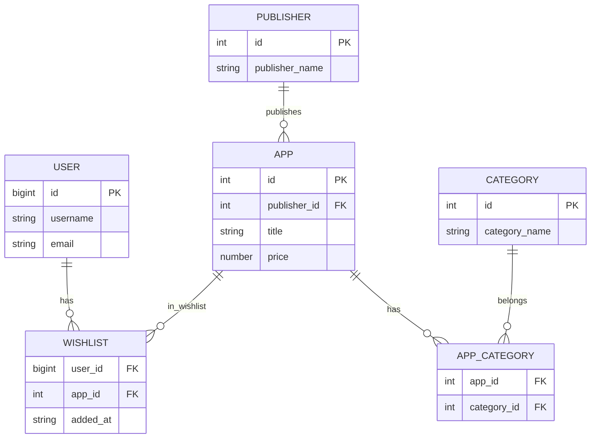

```mermaid
erDiagram
    USER {
        bigint id PK
        string username
        string email
    }

    PUBLISHER {
        int id PK
        string publisher_name
    }

    APP {
        int id PK
        int publisher_id FK
        string title
        number price
    }

    CATEGORY {
        int id PK
        string category_name
    }

    APP_CATEGORY {
        int app_id FK
        int category_id FK
    }

    WISHLIST {
        bigint user_id FK
        int app_id FK
        string added_at
    }

    PUBLISHER ||--o{ APP : "publishes"
    APP ||--o{ APP_CATEGORY : "has"
    CATEGORY ||--o{ APP_CATEGORY : "belongs"
    USER ||--o{ WISHLIST : "has"
    APP ||--o{ WISHLIST : "in_wishlist"
```
