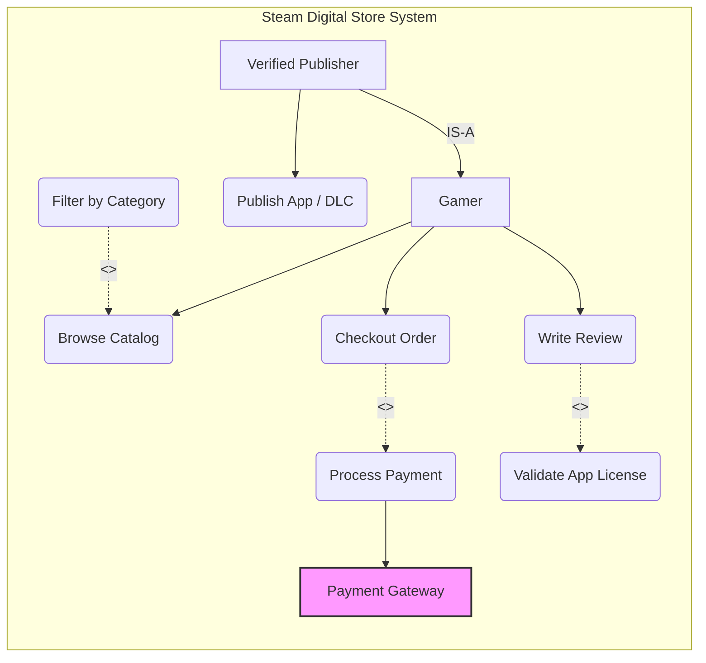

```mermaid
graph LR
    classDef system fill:#f9f,stroke:#333,stroke-width:2px;

    gamer[Gamer]
    publisher[Verified Publisher]
    payment[Payment Gateway]:::system

    publisher -->|IS-A| gamer

    subgraph "Steam Digital Store System"
        UC_Browse(Browse Catalog)
        UC_Filter(Filter by Category)
        UC_Checkout(Checkout Order)
        UC_Payment(Process Payment)
        UC_Review(Write Review)
        UC_Publish(Publish App / DLC)
        UC_Validate(Validate App License)

        gamer --> UC_Browse
        gamer --> UC_Checkout
        gamer --> UC_Review
        publisher --> UC_Publish

        UC_Filter -.->|<<extend>>| UC_Browse
        UC_Checkout -.->|<<include>>| UC_Payment
        UC_Review -.->|<<include>>| UC_Validate

        UC_Payment --> payment
    end
```
