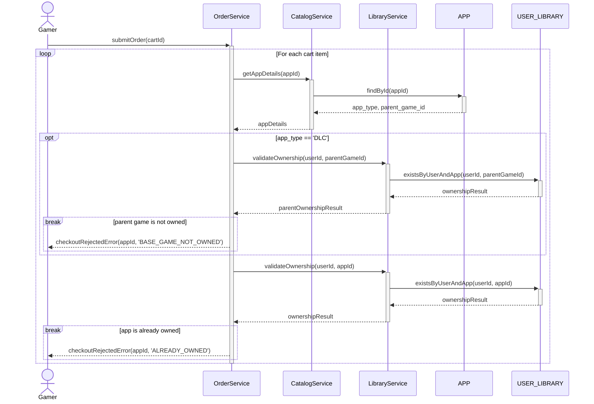

# Sequence Model:  Дублікат або DLC без базової гри

```mermaid
sequenceDiagram
    actor Gamer
    participant OrderService
    participant CatalogService
    participant LibraryService
    participant APP
    participant USER_LIBRARY

    Gamer->>+OrderService: submitOrder(cartId)

    loop For each cart item
        OrderService->>+CatalogService: getAppDetails(appId)
        CatalogService->>+APP: findById(appId)
        APP-->>-CatalogService: app_type, parent_game_id
        CatalogService-->>-OrderService: appDetails

        opt app_type == 'DLC'
            OrderService->>+LibraryService: validateOwnership(userId, parentGameId)
            LibraryService->>+USER_LIBRARY: existsByUserAndApp(userId, parentGameId)
            USER_LIBRARY-->>-LibraryService: ownershipResult
            LibraryService-->>-OrderService: parentOwnershipResult
            break parent game is not owned
                OrderService-->>Gamer: checkoutRejectedError(appId, 'BASE_GAME_NOT_OWNED')
            end
        end

        OrderService->>+LibraryService: validateOwnership(userId, appId)
        LibraryService->>+USER_LIBRARY: existsByUserAndApp(userId, appId)
        USER_LIBRARY-->>-LibraryService: ownershipResult
        LibraryService-->>-OrderService: ownershipResult
        break app is already owned
            OrderService-->>Gamer: checkoutRejectedError(appId, 'ALREADY_OWNED')
        end
    end

    deactivate OrderService
```
