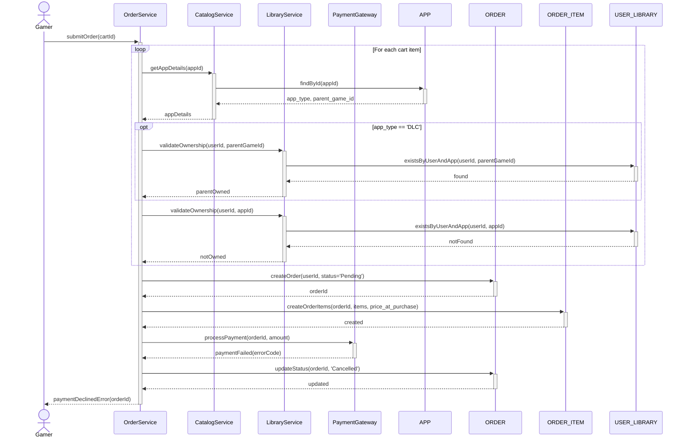

Sequence Model:  Платіжний метод відхилив платіж

```mermaid
sequenceDiagram
    actor Gamer
    participant OrderService
    participant CatalogService
    participant LibraryService
    participant PaymentGateway
    participant APP
    participant ORDER
    participant ORDER_ITEM
    participant USER_LIBRARY

    Gamer->>+OrderService: submitOrder(cartId)

    loop For each cart item
        OrderService->>+CatalogService: getAppDetails(appId)
        CatalogService->>+APP: findById(appId)
        APP-->>-CatalogService: app_type, parent_game_id
        CatalogService-->>-OrderService: appDetails

        opt app_type == 'DLC'
            OrderService->>+LibraryService: validateOwnership(userId, parentGameId)
            LibraryService->>+USER_LIBRARY: existsByUserAndApp(userId, parentGameId)
            USER_LIBRARY-->>-LibraryService: found
            LibraryService-->>-OrderService: parentOwned
        end

        OrderService->>+LibraryService: validateOwnership(userId, appId)
        LibraryService->>+USER_LIBRARY: existsByUserAndApp(userId, appId)
        USER_LIBRARY-->>-LibraryService: notFound
        LibraryService-->>-OrderService: notOwned
    end

    OrderService->>+ORDER: createOrder(userId, status='Pending')
    ORDER-->>-OrderService: orderId
    OrderService->>+ORDER_ITEM: createOrderItems(orderId, items, price_at_purchase)
    ORDER_ITEM-->>-OrderService: created

    OrderService->>+PaymentGateway: processPayment(orderId, amount)
    PaymentGateway-->>-OrderService: paymentFailed(errorCode)

    OrderService->>+ORDER: updateStatus(orderId, 'Cancelled')
    ORDER-->>-OrderService: updated
    OrderService-->>-Gamer: paymentDeclinedError(orderId)
```
