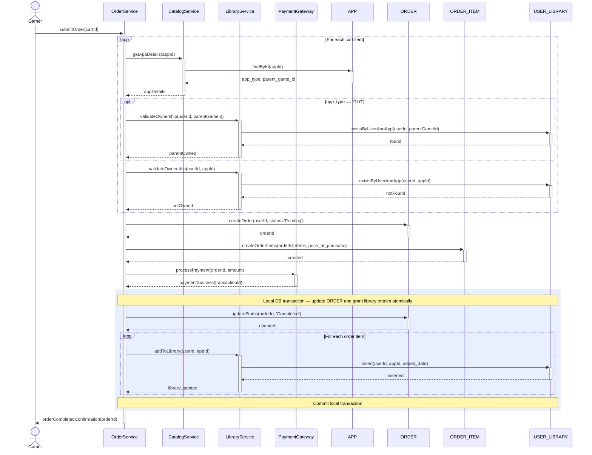

# Sequence Model: Основний сценарій UC-02 (Успішна оплата)

```mermaid
sequenceDiagram
    actor Gamer
    participant OrderService
    participant CatalogService
    participant LibraryService
    participant PaymentGateway
    participant APP
    participant ORDER
    participant ORDER_ITEM
    participant USER_LIBRARY

    Gamer->>+OrderService: submitOrder(cartId)

    loop For each cart item
        OrderService->>+CatalogService: getAppDetails(appId)
        CatalogService->>+APP: findById(appId)
        APP-->>-CatalogService: app_type, parent_game_id
        CatalogService-->>-OrderService: appDetails

        opt app_type == 'DLC'
            OrderService->>+LibraryService: validateOwnership(userId, parentGameId)
            LibraryService->>+USER_LIBRARY: existsByUserAndApp(userId, parentGameId)
            USER_LIBRARY-->>-LibraryService: found
            LibraryService-->>-OrderService: parentOwned
        end

        OrderService->>+LibraryService: validateOwnership(userId, appId)
        LibraryService->>+USER_LIBRARY: existsByUserAndApp(userId, appId)
        USER_LIBRARY-->>-LibraryService: notFound
        LibraryService-->>-OrderService: notOwned
    end

    OrderService->>+ORDER: createOrder(userId, status='Pending')
    ORDER-->>-OrderService: orderId
    OrderService->>+ORDER_ITEM: createOrderItems(orderId, items, price_at_purchase)
    ORDER_ITEM-->>-OrderService: created

    OrderService->>+PaymentGateway: processPayment(orderId, amount)
    PaymentGateway-->>-OrderService: paymentSuccess(transactionId)

    rect rgba(100, 150, 255, 0.15)
        Note over OrderService,USER_LIBRARY: Local DB transaction — update ORDER and grant library entries atomically
        OrderService->>+ORDER: updateStatus(orderId, 'Completed')
        ORDER-->>-OrderService: updated
        loop For each order item
            OrderService->>+LibraryService: addToLibrary(userId, appId)
            LibraryService->>+USER_LIBRARY: insert(userId, appId, added_date)
            USER_LIBRARY-->>-LibraryService: inserted
            LibraryService-->>-OrderService: libraryUpdated
        end
        Note over OrderService,USER_LIBRARY: Commit local transaction
    end

    OrderService-->>-Gamer: orderCompletedConfirmation(orderId)
```
