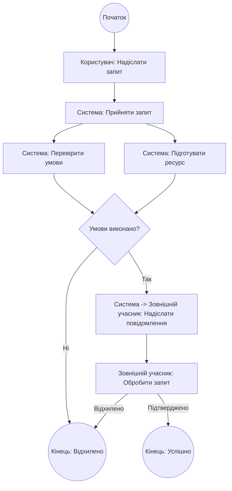

# Lab 4: Модель бізнес-процесу (Activity Diagram)

```mermaid
flowchart TD
    Start((Початок)) --> U1["Користувач: Надіслати запит"]
    U1 --> S1["Система: Прийняти запит"]
    S1 --> P1["Система: Перевірити умови"]
    S1 --> P2["Система: Підготувати ресурс"]
    P1 --> Dec1{"Умови виконано?"}
    P2 --> Dec1
    Dec1 -- "Ні" --> EndDeclined((Кінець: Відхилено))
    Dec1 -- "Так" --> SendMsg["Система -> Зовнішній учасник: Надіслати повідомлення"]
    SendMsg --> ExtProc["Зовнішній учасник: Обробити запит"]
    ExtProc -- "Підтверджено" --> EndMain((Кінець: Успішно))
    ExtProc -- "Відхилено" --> EndDeclined
```
